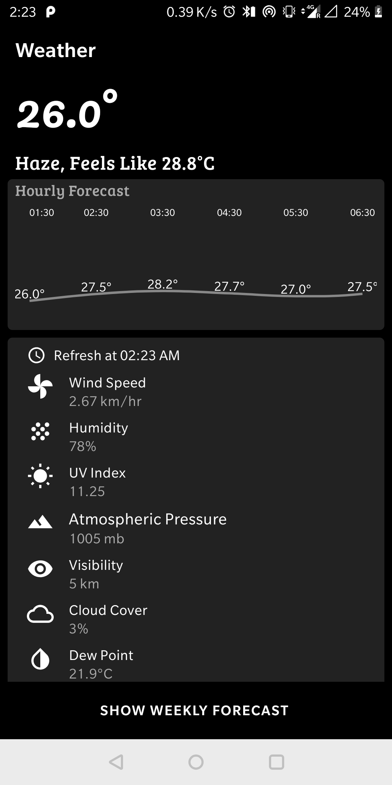
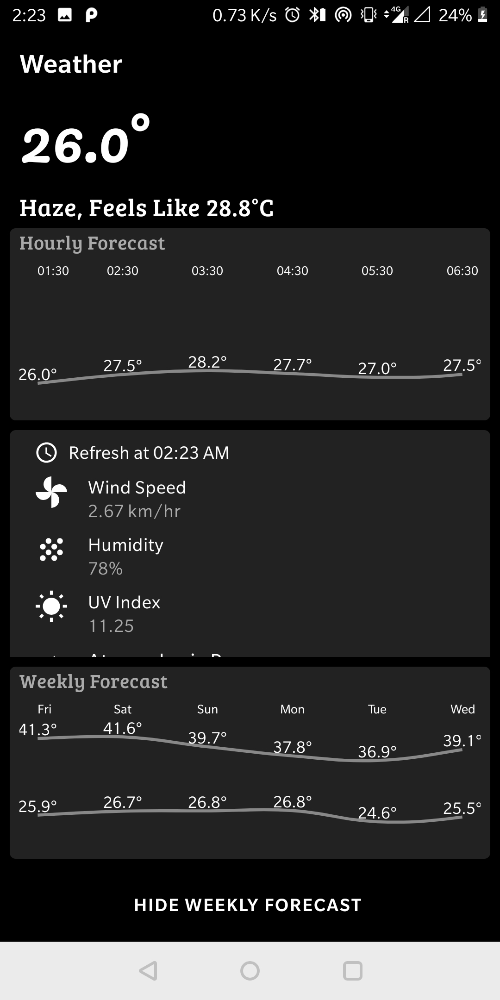

# Weather
Weather App is an Android Application to view current weather details and forecast of next 6 days.
 Weather App can:

1. Display current temperature and weather description
2. Show weather details like wind speed, humidity, UV index, atmospheric pressure, visibility, cloud cover and dew point
3. Show Hourly forecast for next 48 hours
4. Show weekly forecast for next 7 days with minimum and maximum expected temperatures.

## Screenshots

## Libraries Used

* AppCompat, CardView
* Lifecycle
* Material 
* Gson
* Espresso
* Retrofit
* MPAndroidChart

## Architecture

### MVVM
MVVM stands for Model, View, ViewModel. MVVM facilitates a separation of development of the graphical user interface from development of the business logic or back-end logic (the data model). 

#### Model
Model holds the data of the application. Model represents domain specific data and business logic in MVC architecture. It maintains the data of the application. Model objects retrieve and store model state in the persistance store like a database. Model class holds data in public properties. It cannot directly talk to the View.
#### View
View represents the UI of the application devoid of any Application Logic. It observes the ViewModel.
#### ViewModel
ViewModel acts as a link between the Model and the View. It’s responsible for transforming the data from the Model. It provides data streams to the View. It also uses hooks or callbacks to update the View. It’ll ask for the data from the Model.
The following flow illustrates the core MVVM Pattern.

## MVVM implementation in app
<b>Model</b> `WeatherDetails` implements Serializable and holds the Weather Data by using other models: Current, Daily, FeelsLike, Hourly, Location, Rain, Temp, Weather to hold data for the application.

<b>Repository</b> `WeatherDetailsRepository` has following purpose:
- `getLocation()` to get latitude and longitude of user's location by using FusedLocationProviderClient
- `getWeatherDetails()` to get Mutable LiveData of List of `WeatherDetails` objects by fetching from OpenWeatherMap API using Retrofit

<b>ViewModel</b> `WeatherDetailsViewModel` is a class designed to hold and manage UI-related data in a lifecycle conscious way. `WeatherDetailsActivityViewModel` will support `WeatherDetailsActivity` and hold UI related data for it like  and `getWeatherDetails()`. WeatherDetailsActivityViewModel is a lifecycle-aware and it allows data to survive configuration changes such as screen rotation.

<b>View</b> `WeatherDetailsActivity` uses `initWeatherDetailsViewModel()` method to interact with ViewModel to get Weather Details and observe them for any changes.
WeatherDetailsActivity uses `initLocation()` to check for Location permissions and ask the user to grant them if missing.
WeatherDetailsActivity uses `fetchLocation()` to fetch Location details from WeatherDetailsRepository using FusedLocationProviderClient.
WeatherDetailsActivity uses `fetchWeatherData()` to fetch Weather Data from WeatherDetailsRepository from OpenWeatherMap API using Retrofit.
`weeklyForecast()` shows hidden Weekly Forecast panel on press of Show Weekly Forecast Button.
`setWeatherDetailsUI()` sets Weather Data on the respective views of UI.
`setTemperatureChart()` plots line chart for hourly and weekly temperature forecast using MPAndroidChart
Android activity layout `activity_weather_details.xml` has custom toolbar and TextViews for wind speed, humidity, UV index, atmospheric pressure, visibility, cloud cover and dew point. It also has MPAndroidChart Line Charts for Hourly and Weekly temperature forecasts.

## Testing
### Espresso 
Espresso is a testing framework for reliable Android User Interface tests.
Espresso synchronizes test actions with the application interface and ensures that activity is started before testing.

`WeatherDetailsActivityTest` performs User Interface tests using Espresso framework.
It uses fetchWeatherDataToBeTested() fetches the weather data before initiating tests
- windSpeedTextTest() Tests whether Wind Speed Text is correct
- humidityTextTest() Tests whether Humidity Text is correct
- uvIndexTextTest() Tests whether UV Index Text is correct
- pressureTextTest() Tests whether Atmospheric Pressure Text is correct
- visibilityTextTest() Tests whether Visibility Text is correct
- cloudCoverTextTest() Tests whether Cloud Cover Text is correct
- dewPointTextTest() Tests whether Dew Point Text is correct
- weeklyForecastButtonTest() Tests the Show and Hide Weekly forecast button click

Developed By
------------

* Vatsal Yadav  - www.linkedin.com/in/vatsalyadav 
